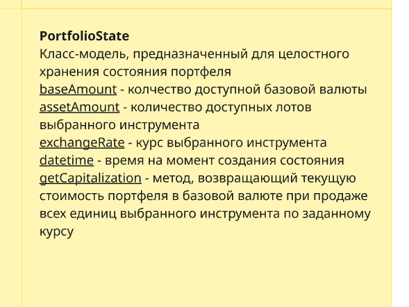
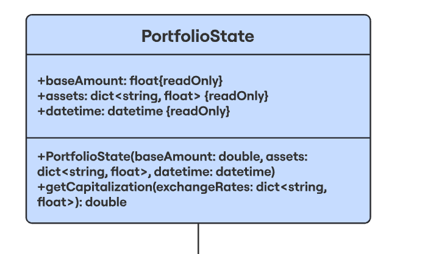
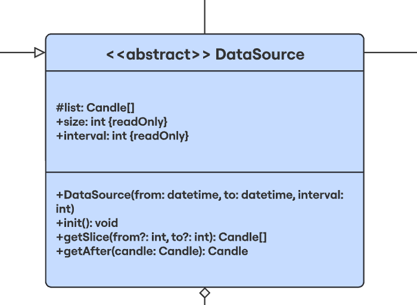
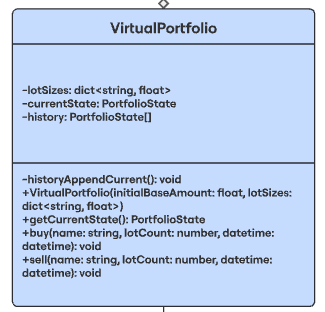
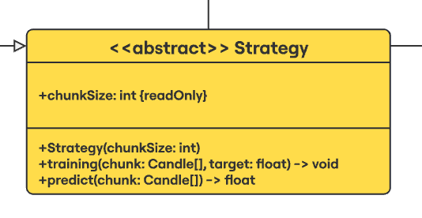
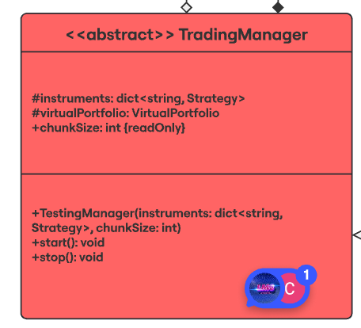
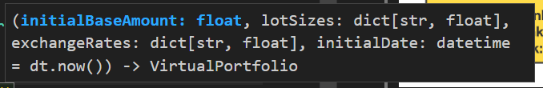
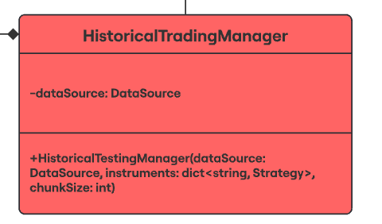

Проект торгового бота, основанный на библиотеке QuikPy и API московской биржи iss.moex.com

при клонировании репозитория выполнить дополнительно команды:
на Windows:
```cmd
cd src
copy config.py configLocal.py
```
на Linux:
```cmd
cd src
cp config.py configLocal.py
```
для предотвращения изменения config.py свои данные записываем в configLocal.py








